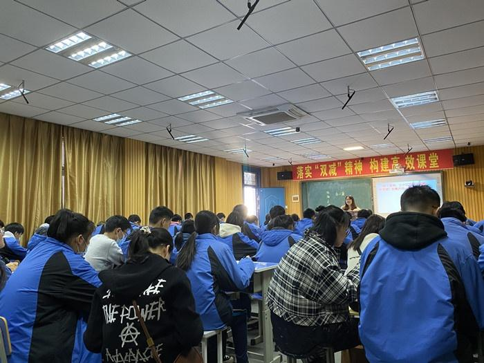

# hxsz2019-11.github.io

这是一个存放和县三中2019级11班班史的网站。

***注意：该网站中蓝色字体均为超链接，点击即可跳转。***

## 目录

***

- [编年][1]
  - [班级大记事][2]
  - [班级史话][3]
- [纪传][4]
  - [教师风采][5]
  - [同学画像][6]
- [外史][7]
  - [日常][8]
  - [经典语录][9]
- [附录][10]
  - [通讯录][11]
  - [组织系统表][12]
  - [奖学金][13]
  - [相册][19]
  - [logo大赏][20]
  - [致谢名单][21]

## 编年

***

### 班级大记事

***
> 以编年的形式，按时间顺序，如实记录三年来班级发生的重大事件。不做具体叙述。

|       日期        |           事件            |
| :---------------: | :-----------------------: |
|   2019年9月2日    |      [入学报名][101]      |
|  2019年10月13日   |    [经典诵读比赛][102]    |
|  2019年10月21日   |    [广播体操比赛][103]    |
| 2019年10月23-25日 |      [校运动会][104]      |
| 2019年10月28-29日 |      [皖南研学][105]      |
|  2019年12月12日   |    [英语书法比赛][106]    |
|   2020年3月2日    |      [网课开始][107]      |
|   2020年4月26日   |        [返校][108]        |
|   2020年9月1日    |     [八年级开学][109]     |
| 2020年10月21-23日 |      [校运动会][110]      |
|   2021年1月12日   |  [英语课文背诵比赛][111]  |
|   2021年4月22日   |   [艺术节遗憾落选][112]   |
| 2021年5月末-6月中 | [老师童和张暂时离开][113] |
|   2021年6月17日   |    [地理生物会考][114]    |
|   2021年9月1日    |     [九年级开学][115]     |
|   2021年9月10日   |   [教师节贴纸活动][116]   |
|   2021年10月7日   |   [墨荷杯作文竞赛][117]   |
| 2021年10月21-22日 |      [校运动会][118]      |
|  2021年11月22日   |     [双减公开课][119]     |
|  2021年12月31日   |  [元旦互送祝福贺卡][120]  |
|   2022年3月5日    |  [中考百日誓师大会][121]  |
|   2022年3月11日   |   [杨飞虎励志演讲][122]   |
|   2022年3月14日   |    [网课再次开始][123]    |
|   2022年4月6日    |     [返校与班会][124]     |

### 班级史话

***
> 具体记叙班级大记事中的事件。

#### 2019年9月2日入学报名

敬请期待。

#### 2019年10月13日经典诵读比赛

敬请期待。

#### 2019年10月21日广播体操比赛

敬请期待。

#### 2019年10月23-25日校运动会

敬请期待。

#### 2019年10月28-29日皖南研学

敬请期待。

#### 2019年12月12日英语书法比赛

敬请期待。

#### 2020年3月2日网课开始

敬请期待。

#### 2020年4月26日返校

敬请期待。

#### 2020年9月1日八年级开学

略。

#### 2020年10月21-23日校运动会

敬请期待。

#### 2021年1月12日英语课文背诵比赛

敬请期待。

#### 2021年4月22日艺术节遗憾落选

敬请期待。

#### 2021年5月底-6月中老师童和张暂时离开

敬请期待。

#### 2021年6月17日地理生物会考

敬请期待。

#### 2021年9月1日九年级开学

略。

#### 2021年9月10日教师节贴纸活动

敬请期待。

#### 2021年10月7日墨荷杯作文竞赛

敬请期待。

#### 2021年10月21-22日校运动会

敬请期待。

#### 2021年11月22日双减公开课

  
敬请期待。

#### 2021年12月31日元旦互送祝福贺卡

敬请期待。

#### 2022年3月5日中考百日誓师大会

敬请期待。

#### 2022年3月11日杨飞虎励志演讲

敬请期待。

#### 2022年3月14日网课再次开始

敬请期待。

#### 2022年4月6日返校与班会

经历了3个星期的煎熬的网课生活，终于迎来了返校。  
2022年4月5日下午1:30，集体做核酸。  
最重要的，当属童老师4月6日上午的班会课。  
班会主题为"花开……"。  
童老师分享了张宇演唱的《一个人万岁》，改编并演唱了《不上学万岁》。  
u1s1, tch yyds  
童老师分享了同学们（虽然仅有3人）的关于压力的想法。而后同学们思维打开，由阐明压力进到了寻找缓解压力的"酶"。  
班会以一首《起风了》结束，起风了，起的是春风，是朝气蓬勃之风，是扬起白帆之风。

## 纪传

***

### 教师风采

***
> 为老师"画像"，表达我们的崇敬之心和感谢之情。

以下为跳转链接，其中*斜体*表示曾经教过11班的老师们。

- [童春花老师][201]
- [冯德好老师][202]
- [张春霞老师][203]
- [孙基斌老师][204]
- [张阳平老师][205]
- [王菊老师][206]
- [严金花老师][207]
- [谢荣霞老师][213]
- [*吴小明老师*][208]
- [*程年龙老师*][209]
- [*陈开晶老师*][210]
- [*项婷婷老师*][211]
- [*贾维维老师*][212]
- ……

#### 童春花老师

童老师是我们班的语文老师，一个很漂亮，很温柔的老师，她可能不那么高，但气势是绝对不差的。还记得七年级刚报名那天，童老师扎了一个马尾辫，轻轻的走进了嘈杂的教室中，我们三年的故事开始了。初见时，心里面在感叹:"这个老师气质真的好独特啊。"现在想来大概就是"腹有诗书气自华"吧。

童老师的语文课堂是独特的，时有笑语，又时常严肃，她总是会分享一些她生活中的小事情，也会和我们一起"逃课"去赏雪景等等。相比较其他班，我们班的语文作业都是比较少的，童老师的作业是十分看重质的，她不会布置很多，但想要认真的完成，还是需要花上一些时间的，并且她的作业形式也是多变的，比如制作人物卡片，写演讲稿…… 提到"演讲稿"，又想起那个学期的"课前五分钟"，童老师会让我们自主准备演讲内容，然后上台发言，她看到的永远不只是学习成绩，她更是希望我们能多方位的发展，希望提高我们的能力，她也总是很放心的将班级事务交给同学们自己打理。

童老师有时候可能会有些迷迷糊糊的，但遇到原则问题绝不马虎，比如文言文必须记熟、记准了，作业一定要按时交等等。临近中考，面对班级里浮躁的现象，童老师也会及时指出，其实童老师面临的任务更加艰巨，学校里，他不仅仅是十一班的语文老师，是班主任还是校长的"得力助手"，在校外她又要顾及自己的家庭，却忘了照顾好自己，也因此离开了一段时间，也很遗憾，很多活动没有童老师的陪伴。

三年的时光很短，短到一眨眼就过去了，又很长，长到我们发生了那么多事，说不完也道不尽。

以上只是我一个人对童老师的印象，于是我又采访了几位同学，更加全面(以下采访均为原话，未进行删减或添加)

首先是建宇同学:"童老师是一名负责认真负责的语文老师，文质彬彬，温文尔雅，与人为善，以优秀为习惯，能歌善舞(好像不会舞)，身高1m95。"

接下来是紫阳同学:"童老师还不错，还可以，还挺好。善良美丽仁慈，教导有方，花容月貌，典则俊雅，仙露明珠，温文尔雅，风度翩翩，诲人不倦，德才兼备，兢兢业业，鞠躬尽瘁，恪尽职守，良师益友。"

然后是子强同学:"童老师温柔教导有方，和蔼宽容，是个值得尊敬的老师。"

再然后是思倩同学:"我觉得童老师给我的第一印象就是漂亮。经过几年的相处，我发现她有时候有点小呆呆，印象最深的就是她的笑声，emmmmm，她也比较有责任心吧。"

再再然后是陈诺同学:"课上严厉，课下温柔，长得漂亮，喜欢穿裙子，脾气不太好。"

最后还有特别邀请人——十二班王祖荣同学:"可爱善良，美丽大方，有一次我印象好深，她穿着一套粉色的运动服装一样的衣服，蹦蹦跳跳的走过来，我以为是学生很有活力。"

#### 冯德好老师

敬请期待。

#### 张春霞老师

敬请期待。

#### 孙基斌老师

> 作者：陈宇

孙基斌是我们班物理老师，与其他老师相比，他只带了我们两年，但是这一点也不重要，因为他是给我们留下印象最深的老师。

他物理教得好就不必多说了，比如曾经10个物理满分就有7个是出自他手。他上课非常幽默风趣，是个出了名的*老变态*。  
当然这是他自己说的，我可不敢这样说，因为他会给我"洗头"。

说到"洗头"，每到炎炎夏日，孙老师就会带上他的滋水枪，如果你引起他的注意，他就会客客气气地帮你洗头。  
其实，我们的孙老师还有一个小目标，就是给所有人洗一遍头。  
~~从这里我们可以学到孙老师的一视同仁。~~

他在讲课的时候每当他用不同的方法把题目解出来的时候，他都会飙起他的名言**条条大路通三中**。

每当考过试后，他又会说，这张试卷我看了，半个小时就能做完，非常简单，**没有最简单只有更简单**。

他还有一个非常厉害的必杀技：*又是一道秒杀题*。  
他长的吧，我认为他长的还算可以。  
~~除了头发有点稀疏~~

他的外貌我认为可以用一个字来形容，那就是**帅**。

#### 张阳平老师

敬请期待。

#### 王菊老师

敬请期待。

#### 谢荣霞老师

> 作者：沈思慧

谢荣霞老师是我们的体育老师，她很高很瘦，说话声音总是温婉柔和，淡淡的，所以有时候说话后面的同学应该听不太清楚，老师发起火来也凶，每次集中时讲一些跑步技巧或一些考试要点时，同学们的声音总此起彼伏的出现，这时谢老师会用凌厉的眼神和一声"安静"让沸沸扬扬的我们平静下来，有时也会批评我们一句"怎么越大还越差啦，耶～怎么一点规矩没有了啊"这时同学们就会把闪亮的目光移向谢老师。

每次跑步时，听到谢老师的"慢跑两圈"底下时不时传来一片哀声，如果看到老师拿个秒表，一脸云淡风轻的笑着对我们说"测个800/1000奥"更是哀声连连（跑的轻松的，满分的除外）这时谢老师就会说"三年了，还没适应啊"（哀怨归哀怨，跑起来可都是铆足干劲）谢老师的"保持精力为我们延长耐力"冲刺时的"快点快点"似乎又为我们增添动力，那一说50米呢，不说个个都生龙活虎吧，但也是不同于800/1000要死要活的，而是看起来有精神（可能被800/1000压榨怕了）老师总不厌其烦的教我们过终点线不要减速，看到我们减速表情总是有些无奈，三年了，我们记住了。

中考体育加试将近，今年的我们算是经历了谢老师的"魔鬼训练"看着每堂课筋疲力竭的我们，谢老师也总是用她轻松却又充满力量的声音安慰我们"咬咬牙，就这一个月，坚持坚持，为了中考"，谢老师还花了快一堂课教我们中考的小技巧，获得同学们的称赞，惊讶。本以为能逃过跑圈的劫，没想到老师一句"不能懒，来，跑几圈"将同学们的幻想打破。

三年的时间，谢老师让我们的体育课不再是懒散的课，而是充满目标方向的课，谢老师用她的经验为我们的初中生活勾勒了浓墨重彩的一笔。

#### 严金花老师

敬请期待。

#### *吴小明老师*

敬请期待。

#### *程年龙老师*

敬请期待。

#### *陈开晶老师*

敬请期待。

#### *项婷婷老师*

敬请期待。

#### *贾维维老师*

敬请期待。

### 同学画像

***
> 每位同学的"自画像"。

以下为快速跳转链接，按照姓氏首字母排序，其中*斜体*表示后来离开11班的同学。

- [鲍子寅][241]
- [卜雅婷][242]
- [陈诺][243]
- [陈启][244]
- [*陈蔚然*][245]
- [陈孝康][246]
- [陈欣凌][247]
- [陈宇][248]
- [*崔想*][249]
- [戴叶威][250]
- [*范和叶*][251]
- [高天宇][252]
- [洪焱炜][253]
- [洪雨燕][254]
- [胡子强][255]
- [胡子阳][256]
- [黄孟][257]
- [伋天佑][258]
- [居东昱][259]
- [李豪][260]
- [李建宇][261]
- [李盛阳][262]
- [刘韩庆][263]
- [刘继强][264]
- [隆晶晶][265]
- [隆思楠][266]
- [彭晨][267]
- [任冉][268]
- [邵俊伟][269]
- [沈思慧][270]
- [孙蕊雪][271]
- [孙睿][272]
- [孙心怡][273]
- [*孙迎运*][274]
- [唐州][275]
- [滕睿][276]
- [王皓哲][277]
- [*王后瀚*][278]
- [王希涛][279]
- [王心语][280]
- [王鑫越][281]
- [王毅杰][282]
- [吴佳欣][283]
- [谢语阳][284]
- [许明庆][285]
- [严国庆][286]
- [杨文凯][287]
- [叶建敏][288]
- [尹天佑][289]
- [余思倩][290]
- [余腾昕][291]
- [袁润野][292]
- [张萃甲][293]
- [张文远][294]
- [张欣然][295]
- [张馨怡][296]
- [张正寰][297]
- [朱明媛][298]

#### 鲍子寅

这里只有一个名字哦。

#### 卜雅婷

这里只有一个名字哦。

#### 陈诺

这里只有一个名字哦。

#### 陈启

这里只有一个名字哦。

#### *陈蔚然*

这里只有一个名字哦。

#### 陈孝康

说到CXK，你先想到什么？那必定是与风度翩翩气宇轩昂虎背熊腰沾不上一点关系的我呀。陈孝康，这个名字应该很好理解，孝既是辈分，也是孝顺。康便是健康，但不知为何，我这个名字跟远在天边的陈尧咨（谥号康肃公）沾上了点亲戚关系，以至于同学们都将卖油翁改编了一下，看完之后我不想鼓掌都不行，若是他们将这份热情放在语文作文和阅读上，我们班语文平均分不想第一的都难呀。

本坤的学习也很"认真"的。语文上只要看到阅读理解，就满怀热情地读，几分钟后的表情就呃逐渐凝固起来——冏，看不懂。数学只要看到难题，就要专研一下，一小时后试卷上写满了草稿，楞是一个都没搞出来。英语选择题吗……三长选短，三短选长，参差不齐选B,两长两短选C，请叫我玄学大师。

我也是比较擅长体育的，就是短跑不太好，白瞎了我一双大长腿。至于长跑，我在今年体育加试中对我那一组的第一已不抱有希望，但对超过第二名一百米（很难）还是比较感兴趣的，这便是自信与实力。

本次新闻联播到此结束，期待您的一键三连。

#### 陈欣凌

这里只有一个名字哦。

#### 陈宇

这里只有一个名字哦。

#### *崔想*

这里只有一个名字哦。

#### 戴叶威

这里只有一个名字哦。

#### *范和叶*

这里只有一个名字哦。

#### 高天宇

这里只有一个名字哦。

#### 洪焱炜

我的名字叫hyw，15岁。住在和县历阳镇一带，未婚。我在三中上学。每天都要上课到晚上6点才能回家。我不抽烟，酒仅止于鸡尾酒。晚上11点睡，每天要睡足7个小时。睡前，我一定喝一杯凉白开，然后做20分钟的被窝挣扎，上了床，马上熟睡。一觉到天亮，可能会把疲劳和压力，留到第二天。百度都说我很不正常。

#### 洪雨燕

我叫洪雨燕，姓洪，名雨燕，其实小时候差点变成了"宇燕"(虽然读音一样)。我今年15岁了，这是我从火星来到地球的第5584天，已经在地球生活了183个月16天。目前觉得地球生活很好，并无异常反应，除了作业有点多，800m有点累以外，好像没啥不好的，还有学数学的我头发都不够了。毕竟是从火星来的，所以自带火星人的气质——偶尔会有些"小激动"，但大部分还是很正常的。火星人还有一个特性:爱睡觉，时常眼睛一闭一睁就是"下个世纪"了。本人也很期待穿越，有时看着窗外乌云密布，再看看笔下成山的作业就会想:"我什么时候穿越啊！"可能这也是火星人对宇宙的渴望吧！火星人也十分喜欢地球上的文字，会经常读一些有意义的书籍，不过后来也没时间了，那套《哈利波特》典藏版已经三年了都没有入手(想想都难受），希望中考完可以如愿以偿的收入。火星人做事其实也是三分钟热度，比如小时候买的呼啦圈、篮球、魔方，好吧，都没怎么深入发展，唯一的就是坚持学了四年的国画(不过现在也忘得差不多了)。还有火星人喜欢和小狗小猫玩，虽然曾被小狗咬过三次，但还是很喜欢小狗。这是目前15岁的火星人，也不知道火星人后期会有什么突变，请敬请期待吧！

#### 胡子强

这里只有一个名字哦。

#### 胡子阳

这里只有一个名字哦。

#### *黄孟*

这里只有一个名字哦。

#### 伋天佑

这里只有一个名字哦。

#### 居东昱

这里只有一个名字哦。

#### 李豪

这里只有一个名字哦。

#### 李建宇

我的名字叫李建宇，十五岁了，实际上才十四岁。有必要说明下，我的名字里的"建"不是"健"，也不知被写错多少次了。

学习上，应该没有什么短腿学科，即使有，我也尽力补上。为了体育加试，经常放学跑步，竟然晒黑了一圈，不过也不亏。

在班级里任班长，经常为班会贡献靓照，甚至开过两次班会，嗯，永生难忘的班会。不过好像不太会管纪律，但会请wxt辅助管理。~~方式：吼~~

我的兴趣爱好一直是个谜。七年级时，喜欢玩魔方。后来魔方不碰了，喜欢玩游戏。再后来游戏不玩了，跑去学编程了。然后发现编程水太深，加上升入九年级，也不碰了。现在空闲时间喜欢搞搞Code，玩玩pvz，偶尔打打车万。~~车万手残玩不过来~~

回首初中生活，比较遗憾的是没好好读过几本书。中考后读个几本，绝不食言。

#### 李盛阳

这里只有一个名字哦。

#### 刘韩庆

这里只有一个名字哦。

#### 刘继强

这里只有一个名字哦。

#### 隆晶晶

这里只有一个名字哦。

#### 隆思楠

这里只有一个名字哦。

#### 彭晨

这里只有一个名字哦。

#### 任冉

这里只有一个名字哦。

#### 邵俊伟

这里只有一个名字哦。

#### 沈思慧

我是沈sh，全名加西亚·梅尔尼克·帕帕多普洛斯·乔治乌·施密特·蒂芬妮·德拉伽·绯瑟·杰思罗·德拉吉察·加斯佩罗尼·查尔斯·亚瑟·阿尔伯特·奥古斯都·路易斯·沈。沈氏集团最大控股人，我每天从800平米的床上醒来，做直升机从卧室来到餐厅，坐在500平米的餐桌上吃早饭，每每看着漆黑的天空总想起我还要上学，所以光彩亮丽且勤奋的我又坐着直升机去学校度过我逍遥朴实的一天。

#### 孙蕊雪

这里只有一个名字哦。

#### 孙睿

哥名乃杰克苏西.尼古拉斯.J.Q.K.梅云耶.冰夜流魅.圣皇甫天尊.s.云殇.r。哥是宇宙第一道光，哥就是你们的太阳，膜拜哥吧，哥就是传说。哥16岁，男，哥是神，懂吗，凡人？沉寂在哥的幻术中吧。哥5岁筑基，7岁金丹，9岁渡劫，12岁大乘，其实哥还有个称号Dark Flame Master.以吾之名，永远沉睡于此吧！

#### 孙心怡

这里只有一个名字哦。

#### *孙迎运*

这里只有一个名字哦。

#### 唐州

余自幼聪慧过人，七岁学步，八而奔，九而跳，年方十岁便可识得十余字，尝考状元，未中，榜眼，未果，探花，未遂，负气归隐，独研长高灵药，有果，no one is taller than me，男儿且自骄，挽弓射天骄，一日，为揍也，一旦卒，吾又复生也，而未猝。

#### 滕睿

这里只有一个名字哦。

#### 王皓哲

本人名王皓哲，属于真核域，动物界，后生动物亚界，后口动物总门，脊索动物门，脊椎动物亚门，羊膜总纲，哺乳纲，兽亚纲，真兽次亚纲，灵长目，真灵长半目，直鼻猴亚目，人猿次目，狭鼻下目，真狭鼻小目，人猿超科，人科，人亚科，人族，人属，人亚属，智人种未成年男性动物，民族汉，年将十五。生肖属猪。不擅数学，不热爱学习，热爱祖国，热爱人民，热爱社会主义。好书，好音乐。好网上冲浪。无职权。有强迫症。宠辱不惊。有性格弱点。

#### *王后瀚*

这里只有一个名字哦。

#### 王希涛

王希涛，一个九(11)班普普通通的男孩，可我的名字却是宝藏，有许多亮点来发掘。大抵是名字与王羲之雷同，大家总以为我和王羲之有关系，也许前世是的吧。还有一首诗曰："万条垂下绿丝绦。"丝绦和希涛是同音词，每提此事，总有些尴尬。

再来谈谈我这个人吧。都说人贵有自知之名，我也一样。我自知长相不俊俏，但长的好看应该不算自傲吧。初来时身高不出众(现在也是)，但也正常。成绩也如凉白开，平平淡淡，对于班上的顶尖高手更是自愧不如。性格上我这个人比较直白，不喜欢太麻烦，更不愿干麻烦事，但如果你需要帮助，那我会力所能及的帮你(不提供特殊帮助，如:借作业抄)我也十分开朗，如果处久了，你会发现我平易近人，但对于刚认识的人则有些羞涩(女生除外:无论相识多久，总有些shy)。我还有些大胆，对于新事物总是好奇，对于喜欢的人也从不埋在心底，如果不小心伤害了你，影响了你，给你造成麻烦，希望得到谅解(也许是太喜欢你了)

这就是我，普通中带着新颖的我。

不知不觉间已和大家相处三年，虽有不舍，但天下没有不散筵席，希望在见时，你们会遇见崭新的我，我也会遇见崭新的你们。

#### 王心语

这里只有一个名字哦。

#### 王鑫越

这里只有一个名字哦。

#### 王毅杰

这里只有一个名字哦。

#### 吴佳欣

这里只有一个名字哦。

#### 谢语阳

你了解谢yy吗?

担任中国谢氏财团董事长，金钱地位颜值在全球遥遥领先世界各地，3岁从就读于清华，6岁开始全身心投入到企业当中，谢氏集团在其带领下，已经领先全球，在地球男女眼中是触手不及得的一般存在。

#### 许明庆

这里只有一个名字哦。

#### 严国庆

这里只有一个名字哦。

#### 杨文凯

这里只有一个名字哦。

#### 叶建敏

这里只有一个名字哦。

#### 尹天佑

我是尹天佑，我的爱好从爱尔兰到契丹无人不知无人不晓，那就是游戏。尽管花在游戏上的时间不少，但水平却一直很菜，不过离谱的是在游戏中学到了不少历史知识。

成绩一直很稳定，长期保持在班级第三（除了一次政治答题卡没扫上去）。年级排名基本在30名以内，偶尔运气好能上第三。最喜欢的科目是历史，（~~其实是喜欢听故事~~），在此之前则是地理和生物，（单纯比较有趣）。平日里不喜欢出门，因此体育比较差；由于各种原因，数学和语文也不太行。不过我相信凭借我的努力，这几门课不拖后腿应该没问题。

在班级里担任团支部书记，此外还被抓了壮丁当了组长。虽然我不深谙收作业之道，但是收齐作业和收齐名单绝对没有问题。

从来不参与大型内卷（不过少量内卷还是存在）,因此睡眠时间一般不会不足。居家学习状态能与在学校学习差不多（主要是得益于大量的作业），这是我九年级来最引以为傲的一件事。

回首三年，我成长了很多，也学到了很多知识。最后悔的是没有把时间的利用效率提到最高，总是把时间浪费在无聊的事情上，玩也没有玩好，学也没有学好。希望在不久的中考我能取得一个能让我自己满意的成绩，也希望在未来我能摒除一切杂念，做一事就专心做好这一事。

#### 余思倩

这里只有一个名字哦。

#### 余腾昕

这里只有一个名字哦。

#### 袁润野

这里只有一个名字哦。

#### 张萃甲

这里只有一个名字哦。

#### 张文远

这里只有一个名字哦。

#### 张欣然

这里只有一个名字哦。

#### 张馨怡

这里只有一个名字哦。

#### 张正寰

这里只有一个名字哦。

#### 朱明媛

明媛今年十五岁了，但是却觉得自己才十一岁。"明媛"这个名字是老太取的，同"名媛。"另，老太喜欢取名字。明媛知道，民国时期的大家闺秀都被称为"名媛"。所以自出身以来就保持着"温婉贤淑"的优良性格？(反正我是不信)

明媛在学校是一个名副其实的好孩子，同学们都认为她的性格很好一她自己也是这样认为的。同时,她满脑子"古言Be文""狗血虐番"，说出来估计也没人感兴趣，所以，还是她自己独自美丽吧。

明媛喜欢文科。因为她只有文科成绩还不错，暗恋了数学九年后被现实打败。但是，明媛相信"天生我材必有用"所以在偏科的道路上一去不复返……(好孩子一定不要学! ! ! )明媛说她挺喜欢读小说(正经小说！)，常常熬夜，一熬夜就饿，一饿就点外卖，所以一年比一年大一码……但是，明媛真的很爱读小说。什么小说？其实她什么种类的书都很喜欢看。真的，她不挑食！另外，明媛很讨厌体育，刻骨铭心的讨厌，上体育课前会想吐的那种讨厌。但是，没办法，体育中考得拿分呐！所以明媛在体育场上狂卷十五圈后，腿废了，至今仍隐隐作痛……

## 外史

***

### 日常

***
> 记录各种小事。

#### 冯老师扒火车

2021年11月17日，冯老师提起了那段经历。某大学某宿舍12名学生逃课去爬泰山，但是一分钱未带。一行人便决定扒火车，很快就被抓住了。但是列车长心好，没有赶他们下车。由于无票，一直乘车到了终点站，向着开发区走了约莫1小时，竟走出去了。而后便看到了壮观的泰山日出。至于怎么返回的？还是扒火车啊。

#### 浅谈网课生活

> 2022年3月14日~4月5日网课生活总结。

- 消失的语文直播
- 离谱的数学作业
- 物理课的静止ppt
- 历史课的吐槽app
- 化学老师的哈喽哈喽
- 政治老师的突然停电
- 以及
  - 张老师谈科举
  - 张老师谈理化
  - 张老师谈名人
  - 张老师谈政治制度
  - 张老师谈疫情防控
  - 张老师谈文艺作品
  - 张老师谈国外生活
  - 还有，张老师谈英语

#### 2022年4月14-15日一模

> 作者：佚名

2022年4月15日和县三中第一次模拟会战结束，这次会战中，联合科目集中了所有力量，彻底摧毁了躺平第三帝国的意志 ，这标志着第二次网课大战时代的结束，这一战后，躺平11班分裂为坚持计划学习的内卷联邦和坚持自然学习的摆烂联盟。

### 经典语录

***
> 收录老师们的名言 or 口头禅。

- 英语张老师
  - 少见少有。
  - 你这孩子废的了。
  - 貌似很认真。
  - 吃屎难还是背书难？
  - Are you sure?
  - 屎不到肛门不拉。
  - 你是什么物种啊。
  - 李豪上来拉题目。
  - 吃屎还要起早。
  - 你看，这题他做错了，说明什么啊，说明这是他自己做的，没有抄。
  - 菩萨不张嘴，神仙难下手。
- 物理孙老师
  - 条条大路通三中。
  - 秒杀。
  - 细心细心再细心，认真认真再认真。
  - 现在的老师越来越累了，没有最累，只有更累。
  - 现在的学生越来越躺平了，没有最平，只有更平，都快180度了。
  - 现在的试卷越来越简单了，没有最简单，只有更简单。
  - 药没吃还是药吃多啦。
  - 不怕同桌是学霸，就怕同桌上网课。
  - 把这个拍下来，给下一届看看。
  - 一直在模仿，从未超越。
- 化学张老师
  - 情商低得要死。
  - 畜生！
  - 好男不跟女斗。
  - 哈咯甜甜圈们。
  - 猪队友。
  - 错了给你头打漏。
  - 个照，照哈。
- 数学冯老师
  - 随吹。
  - 阿门。
  - 没有无缘无故的爱，也没有无缘无故的恨。
  - 吃蚕豆，开飞机，还是倒立？
  - 大哥大姐们，同志们。
  - 下面我们来进行测验。
  - 黑猫白猫，捉到老鼠就是好猫。能写出答案的方法就是好方法。
  - 分解不彻底，等于你去死。
  - 缺钙补钙，缺铁补铁。
- 政治严老师
  - 孩子们啊，这样啊，不行啊。
  - 个照啊。
- 历史王老师
  - 我最近学了个词，叫内耗。
- 语文童老师
  - 让优秀成为一种习惯。

## 附录

***

### 通讯录

***
敬请期待。

### 组织系统表

***
> 以毕业时为准。

|    职务    |  姓名  |
| :--------: | :----: |
|    班长    | 李建宇 |
|   副班长   | 胡子阳 |
|  学习委员  | 张文远 |
|  文艺委员  | 胡子强 |
|  体育委员  | 沈思慧 |
|  卫生委员  | 王希涛 |
|  生活委员  | 王心语 |
|  安全委员  | 袁润野 |
| 团支部书记 | 尹天佑 |
| 语文课代表 | 洪雨燕 |
| 数学课代表 | 李盛阳 |
| 英语课代表 | 居东昱 |
| 物理课代表 |  陈宇  |
| 化学课代表 | 卜雅婷 |
| 历史课代表 | 王鑫越 |
| 政治课代表 | 张馨怡 |
| 电器管理员 | 朱明媛 |

### 奖学金

***
> 11班的考试奖学金颁发规则。  
> ~~双减政策出台后，排名表不再公布，也不存在什么奖学金了。~~

- 年级排名奖
  1. 年级前50：20元
  2. 年级160~51：15元
- 进步奖
  1. 年级前50：5元/10名
  2. 年级160~51名：5元/20名
  3. 年级161及以后：5元/30名
- 特别奖  
特别奖奖金50元。把发给每次考试中令大家刮目相看的人。  
~~共有0人获此奖~~

### 相册

> 各种各样的图片。存于百度网盘。

相册链接：[点我跳转](https://pan.baidu.com/s/15s8uA-303Spla81S8QeBpQ?pwd=ab2b)

### logo大赏

***
> 收录同学们设计或提供的logo

**现用logo**  
  
设计者：李建宇  
解释：C 代表 Class ， C11 代表 11班。  
~~当然这个logo十分简陋，未来会不会换我也不清楚。~~

  
提供者：王希涛  
**解释**：  
背景：一片蔚蓝的天空，可以联想到学校的校服是蓝色的，有回忆的意味。天空也象征着未来的海阔天空。  
中间的图案：一个大的月牙中有两个小月牙，寓意着班级对我们的保护，也反映了老师对我们的关爱，又可以看到月是不完整的，想到人有悲欢离合，月有阴晴圆缺。反映相聚终有分离，但也期盼来日再见。月亮常与星为伴，这大月牙上的也反映了同学们之间深厚的友谊。最后中间的class11可以看出我们是11班。  
总结：整个图片可以反映出同学间深厚的友谊，班级的保护，老师们的关爱，将离的不舍，以及对美好未来的憧憬。

  
提供者：王鑫越  
解释：敬请期待。

  
提供者：王鑫越  
解释：敬请期待。

<!--   
提供者：张正寰  
解释：敬请期待。 -->

### 致谢名单

***
> 向在班史编辑工作中表现突出的人员表示感谢。

- 童老师：班史编辑的提出者，提供了144张图片。
- 李建宇：班史编辑的牵头人，也是技术提供者。
- 余腾昕：具体安排班史编辑分工的人。
- 洪焱炜：将logo从纸上搬运至网络上的人。
- 胡子强：艺术类史官，也是参与logo设计的人。
- 张文远：艺术类史官，也是参与logo设计的人。
- 朱明媛：史官，也是最早提交自传的人。
- 王鑫越：提供了2个logo。
- 王希涛：提供了1个logo。
- 任冉：第一位提交自画像的人。
- 沈思慧：为谢荣霞老师"画像"的人，也是第一个提交老师画像的人。
- 洪雨燕：史官，为童春花老师"画像"的人。
- 陈宇：为孙基斌老师"画像"的人。

<!-- 0~100以内，为大标题链接-->
[1]:#编年
[2]:#班级大记事
[3]:#班级史话
[4]:#纪传
[5]:#教师风采
[6]:#同学画像
[7]:#外史
[8]:#日常
[9]:#经典语录
[10]:#附录
[11]:#通讯录
[12]:#组织系统表
[13]:#奖学金
[19]:#相册
[20]:#logo大赏
[21]:#致谢名单
<!-- 101~200 为班级大记事链接 -->
[101]:#2019年9月2日入学报名
[102]:#2019年10月13日经典诵读比赛
[103]:#2019年10月21日广播体操比赛
[104]:#2019年10月23-25日校运动会
[105]:#2019年10月28-29日皖南研学
[106]:#2019年12月12日英语书法比赛
[107]:#2020年3月2日网课开始
[108]:#2020年4月26日返校
[109]:#2020年9月1日八年级开学
[110]:#2020年10月21-23日校运动会
[111]:#2021年1月12日英语课文背诵比赛
[112]:#2021年4月22日艺术节遗憾落选
[113]:#2021年5月底-6月中老师童和张暂时离开
[114]:#2021年6月17日地理生物会考
[115]:#2021年9月1日九年级开学
[116]:#2021年9月10日教师节贴纸活动
[117]:#2021年10月7日墨荷杯作文竞赛
[118]:#2021年10月21-22日校运动会
[119]:#2021年11月22日双减公开课
[120]:#2021年12月31日元旦互送祝福贺卡
[121]:#2022年3月5日中考百日誓师大会
[122]:#2022年3月11日杨飞虎励志演讲
[123]:#2022年3月14日网课再次开始
[124]:#2022年4月6日返校与班会
<!-- 201~240 为老师链接-->
[201]:#童春花老师
[202]:#冯德好老师
[203]:#张春霞老师
[204]:#孙基斌老师
[205]:#张阳平老师
[206]:#王菊老师
[207]:#严金花老师
[208]:#吴小明老师
[209]:#程年龙老师
[210]:#陈开晶老师
[211]:#项婷婷老师
[212]:#贾维维老师
[213]:#谢荣霞老师
<!-- 241~300为学生链接-->
[241]:#鲍子寅
[242]:#卜雅婷
[243]:#陈诺
[244]:#陈启
[245]:#陈蔚然
[246]:#陈孝康
[247]:#陈欣凌
[248]:#陈宇
[249]:#崔想
[250]:#戴叶威
[251]:#范和叶
[252]:#高天宇
[253]:#洪焱炜
[254]:#洪雨燕
[255]:#胡子强
[256]:#胡子阳
[257]:#黄孟
[258]:#伋天佑
[259]:#居东昱
[260]:#李豪
[261]:#李建宇
[262]:#李盛阳
[263]:#刘韩庆
[264]:#刘继强
[265]:#隆晶晶
[266]:#隆思楠
[267]:#彭晨
[268]:#任冉
[269]:#邵俊伟
[270]:#沈思慧
[271]:#孙蕊雪
[272]:#孙睿
[273]:#孙心怡
[274]:#孙迎运
[275]:#唐州
[276]:#滕睿
[277]:#王皓哲
[278]:#王后瀚
[279]:#王希涛
[280]:#王心语
[281]:#王鑫越
[282]:#王毅杰
[283]:#吴佳欣
[284]:#谢语阳
[285]:#许明庆
[286]:#严国庆
[287]:#杨文凯
[288]:#叶建敏
[289]:#尹天佑
[290]:#余思倩
[291]:#余腾昕
[292]:#袁润野
[293]:#张萃甲
[294]:#张文远
[295]:#张欣然
[296]:#张馨怡
[297]:#张正寰
[298]:#朱明媛
